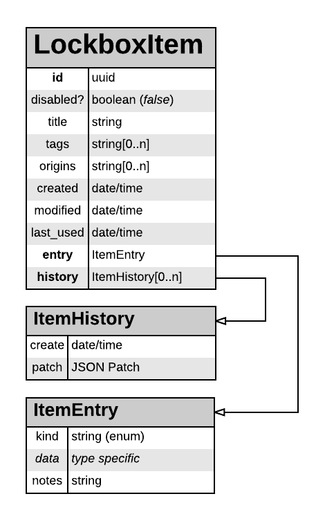
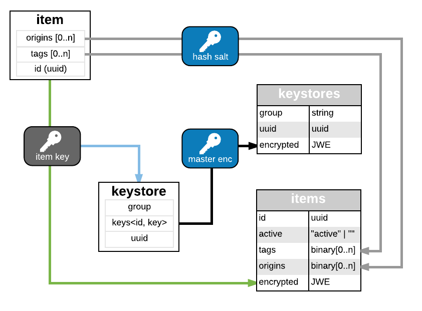
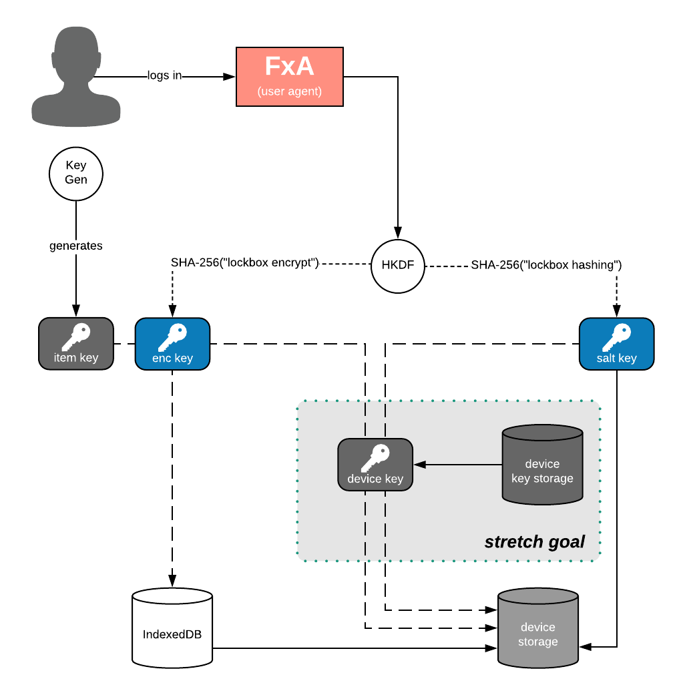

## Overview

Lockbox manages sensitive user data; to start will be web logins, but eventually anything the user wants protected -- any credentials, credit card information, shipping and billing addresses, etc.  Such data requires a high degree of protection.  This document details an approach to protecting Lockbox data.

This approach does not assume the user will -- or can -- use device-wide data protection methods (_e.g._, BitLocker, FileVault2).  Such technology is not universally available, and where it is available is not automatically enabled.

## Themes

- User data is kept in a protected as much as possible
- Re-use commonly available technologies to protect user data, both locally on disk and in remote storage
- Allow for future expansion while mitigating wholesale changes to how that data is stored
- Allow incremental updates to user's data, and eventually incremental user-driven exposure of data (_e.g._, sharing with a team/family)

## Item Data Format

The cleartext data format is JSON, and fits into the illustrated schema.

 

An item is an Object, that is divided into three portions:

- Top-level metadata
- Content-submitted entry data
- Item history data

The data storage module does not maintain a cache of the cleartext values.  Each read operation (listing, retrieving) and removing includes a decrypt step; adding involves an encrypt step; updating includes decrypt and encrypt steps.  Consumers of the data storage module (_e.g._, desktop extension, iOS mobile app) **MAY** have a cleartext cache of some or all Lockbox Items in order to operate.

### Metadata

The top-level metadata is everything about the item that does not typically need to be filled into a form.  It consists of the following:

- **`id` (string)**: This member is a UUID that uniquely identifies the item, and **SHOULD** be a type-4 (random) UUID.
- **`disabled` (boolean)**: This member indicates whether or not the item is disabled.  Disabled items **SHOULD NOT** be used to fill forms.
- **`title` (string)**: This member is a user-entered title or name for the item.  It can default to the origin/domain the item's entry data was created for.
- **`tags` (string[])**: This member is an array of user-defined tags.  This member may be empty or omitted entirely.
- **`origins` (string[])**: This member is an array of URIs this item can be applied to.  Typically an item has at most one origin, but advanced users can add additional origins if they are confident each is logically for the same owner.
- **`created` (date/time)**: This member timestamps when the item was created.
- **`modified` (date/time)**: This member timestamps when the item was last changed.  This includes **any** change to the item, be it entry data or metadata; the only exception is if the `last_used` member is changed.
- **`last_used` (date/time)**: This member timestamps when the item was last accessed to fill a form.

### Entry Data

The entry data is an Object that contains a type specification and the values needed to populate forms. The specifics of this JSON object are determined by the "kind" member.

- **`kind` (string)**: This member indicates the kind of entry data contained.  Currently the only value defined is "login".
- **`notes` (string)**: This member is a catch-all of information the user can set additional information about the item (_e.g._, security questions/answers).

#### "Login" Kind

The entry type "login" stores login credentials.  This entry type has the following additional members:

- **`username` (string)**: This member is the username value
- **`password` (string)**: This member is the password or secret value

### Entry History

History tracks changes to the item's Entry data only.  This portion is an array of objects, ordered from newest to oldest change  Each history object consists of the following:

- **`created` (date/time)**: The date/time in UTC this history item was created, which marks when the succeeding change was made.
- **`patch` (object)**: The changes to apply to the Entry data. This value is the [JSON Merge Patch][RFC7396] difference between the current and previous values.

### Regarding Date/Time Values

All of the date/time values in this format are represented as JSON strings formatted according to [RFC3339]'s internet date-time.  All date/time values are in UTC; the time-offset **MUST** be "Z".

### Limits

The following limits are imposed within a Lockbox Item:

* **`title`** - maximum length of 500 characters
* **`entry.username`** - maximum length of 500 characters
* **`entry.password`** - maximum length of 500 characters
* **`entry.notes`** - maximum length of 10000 characters
* **`origins`** - maximum amount of 5 origin values, origin value maximum length of 500 characters
* **`tags`** - maximum amount of 10 tags, tag value maximum length of 500 characters
* **`history`** - maximum amount of 100 history values

## Database Usage

The following diagram illustrates the tables used to store Lockbox items:

- **Items table**: This table stores the actual Lockbox items. Each row is keyed by the item's UUID and its value is the JSON serialization of the item, encrypted using its associated item key.
- **Origins table**: This table stores (hashes of) origins associated with their Lockbox items.  Each row is keyed by the (hashed) origin and its value is the set of associated Lockbox items' UUIDs.  Ideally there should only be one item per origin hash, but users may have multiple items associated to the same origin (e.g. "gmail.com" login for both personal and work).
- **Tags table**: This table stores the (hashes of) tags associated with their Lockbox items.  Each row is keyed by the (hashed) tag and its value is the set of associated Lockbox items' UUIDs.
- **Keystores table**: This table stores the keystore(s), which maintain the encryption keys used to encrypt Lockbox items.  Each row is keyed a group name ("" for the default group) and its value is the keystore serialized to JSON, encrypted using the master encryption key.

### Origin and Tag Hashing

For a given item, each origin (and tag) is maintained in a separate table to take advantage of indexed searches without requiring each entry to be stored on disk decrypted.  In order to increase the cost of data harvesting if an attacker has access to the local device, these values are first hashed with a salt value unique to the user.  Such salting then requires an attacker to generate a table unique to the user rather than relying on a global precalculated table of hashes, turning a data harvesting attack from a relatively passive action into an active attack.

### Item Value Encryption

Each item is encrypted using a randomly-generated key specific to it.  Using randomly generated per-item keys allows for the following benefits:

- Incremental updates that do not require application-wide tracking of nonces
- Future per-item features and behaviors (_e.g._, sharing items with others) that minimizes any required rekeying and re-encrypting.

Items are encrypted according to [JWE], utilizing the Compact Serialization, with the following parameters:

- **Key Distribution Algorithm ("alg")**: "dir" (Direct key encryption)
- **Content encryption algorithm ("enc")**: A256GCM

### Item Key Encryption

To facilitate synchronization of keys across devices, item keys are encrypted using a master encryption key.  The item keys are maintained as a JSON object, mapping from the item `id` to its encryption key (represented as a [JWK]).  The keystore is serialized to JSON and encrypted before storage; the encryption follows [JWE], utilizing the Compact Serialization, with the following parameters:

- **Key distribution algorithm ("alg")**: "dir" (direct key encryption)
- **Content encryption algorithm ("enc")**: A256GCM

## Key Management

The following diagram illustrates the various keys used in Lockbox:

- **Firefox Application-derived key (app prekey)**: This value is generated from a user's FxA credentials specifically for this application ("lockbox"), and is used as an input factor to generate other encryption keys and hashing salts. The values derived from this prekey are:
  - **Encryption Key (enc key)**: This value is used to encrypt the item encryption keystore(s)
  - **Hashing salt (salt key)**: This value is used as the salt when generating search hashes for user data.
- **Item Key**: The item key is used to encrypt a specific Lockbox data item.  Item keys are maintained with an item keystore, which is itself encrypted using the master encryption key and synchronized via Kinto.

### FxA-based Salt Derivations

From the FxA application prekey two values are derived: the encryption key and the hashing salt.  Both are derived using [HKDF] using HMAC-SHA-256.

Deriving the encryption salt uses the following input factors:

- **Input Keying Material (IKM)**: FxA "lockbox" application prekey
- **Salt**: FxA user id (uid) (or "" if not known)
- **Info**: SHA-256("lockbox encrypt")
- **Output Length (L)**: 32 (the octect length of a AES-256-GCM symmetric key)

Deriving the hashing salt uses the following input factors:

- **Input Keying Material (IKM)**: FxA "lockbox" application prekey
- **Salt**: FxA user id (uid) (or "" if not known)
- **Info**: SHA-256("lockbox hashing")
- **Output Length (L)**: 32 (the length of a SHA-256 hash value)

### Item Key Generation

Each item key is generated using a cryptographically strong source of entropy, such as from `crypto.subtle.generateKey()`.

## Import and Migration

### From Firefox Logins

The following table assumes migration from the JSON format stored on disk:

| **From Firefox** | **Into Lockbox** | **Notes** |
| --- | --- | --- |
|  | `id` = **uuid()** | Generates a new unique UUID |
| `id` |   | Skipped |
| `hostname` | `origins[0]` |   |
| `httpRealm` |   | Skipped |
| `formSubmitURL` | `origins[1]` | Only if not a duplicate of "hostname" |
| `usernameField` |   | Skipped |
| `passwordField` |   | Skipped |
|  | `entry.kind` = **"login"** |  |
| `encryptedUsername` | `entry.username` | Decrypted during migration |
| `encryptedPassword` | `entry.password` | Decrypted during migration |
| `guid` |  | Skipped |
| `timeCreated` | `created` | UNIX timestamp →  RC 3339 |
| `timeLastUsed` | `last_used` | UNIX timestamp →  RC 3339 |
| `timePasswordChanged` | `modified` | UNIX timestamp →  RC 3339 |
| `timesUsed` |   | Skipped |

## Security Considerations

### Guest Mode

Lockbox currently supports a "guest mode" usage, providing a path to ramp up user's security hygiene. This mode adheres to this document with the following differences:

* The FxA user id (used for deriving other keying material) is treated as the empty string ("").
* The master encryption key is a well-known and hard-coded value, per application (_e.g._, desktop extension versus iOS application versus Android application).
* All data is stored **ONLY** locally on the user's device; there is no interaction with cloud-based services.

"Guest mode" does not significantly improve data protection over simply storing files onto their devices.  However, by maintaining consistency with the FxA-backed security features, it reduces potential vulnerabilities between trial uses and more secure credential-based uses.

### Item Origins

Each Lockbox item permits multiple origins to be associated with it.  However, having more than one origin should be rare, and the user should be warned that providing multiple origins increases the risk of compromise.  Lockbox should never automatically add more than one origin to a given item, it **MUST** be left to the user to do this.

It is also possible for multiple items to have the same origin.  This is a much more common occurrence, for instance a user that has both personal and business/work accounts to a cloud-based service (_e.g._, Gmail).

Finally, the precise value of "origins" elements is still to be determined. An initial (possibly naive) approach is to use just the hostname.  However, it is likely desirable to match on a subdomain (e.g, matching "m.facebook.com" if there is an item with "facebook.com") but requires careful forethought (_e.g._, "myfacebook.com" must not match "facebook.com") since the searches occur against cryptographic hashes.  Further research and experimentation needed to determine the correct approach.

### Storing "Master" Keys and Salts

The application prekey and the two derived keys ("enc key" and "salt key") vastly increase the success chances of attacks if stored on the user's devices in the clear.  The document ["Lockbox Secure Device Storage"][lockbox-secure-device-storage] provides a more complete discussion of options and approaches.

Storing the application prekey exposes the user's items to the attacker, if the attacker can determine the derivation parameters (which are not themselves secret).  Storing the "enc key" also exposes the user's items to the attacker, but with the obstacles of derivation already removed.  These values **MUST NOT** be stored unless the device has secure data isolation between users (and ideally between running applications) and the data remains on the device under the control of Lockbox.

For the "salt key", storing this allows an attacker to more easily generate the dictionary tables needed to match the hash input to the result, allowing an attacker to determine what origins and tags a user has associated items for.  However, the risk is far less than storing "enc key"; the hashing scheme documented herein requires the attacker to generate a table per targeted user and guess values for each user, changing from a passive data collection effort into an active data collection effort.

### Nonce Generation

AES-GCM is particularly sensitive to nonce re-use.  Some care may need to be taken to ensure the same key/nonce (i.e., initialization vector or "iv") combination is not used more than once for different plaintexts.  A randomly-generated nonce using a cryptographically strong generator is unlikely to result in duplication.  However, if this is deemed to be inadequate, a strategy for deterministic nonce generation may be developed.

### Key Rotation

Key rotation for individual items can be accomplished in a relatively straightforward manner:

1. Duplicate the item, changing it's UUID
2. Generate a new key, associated to the duplicate item's UUID
3. Encrypt duplicate item with the new key
4. Discard previous item

Duplication is necessary to mitigate any possible confusion over which key a given item is encrypted with -- it is always with the key mapped to the item's UUID, and the item's UUID is always mapped to a single key.

Rotating the master key is far more difficult.  One possibility is to mix a version number into the encryption key derivation, although this requires coordination of version numbers across all of a user's devices in some manner that does not itself require encryption.

[HKDF]: https://tools.ietf.org/html/rfc5869
[JWE]: https://tools.ietf.org/html/rfc7516
[JWK]: https://tools.ietf.org/html/rfc7517
[lockbox-secure-device-storage]: https://docs.google.com/a/mozilla.com/document/d/1e44bUKgHFsmznUkl1v9vgTFjRt1GQH7QSwqZECbpqQg/edit?usp=sharing
[RFC3339]: https://tools.ietf.org/html/rfc3339
[RFC7396]: https://tools.ietf.org/html/rfc7396
