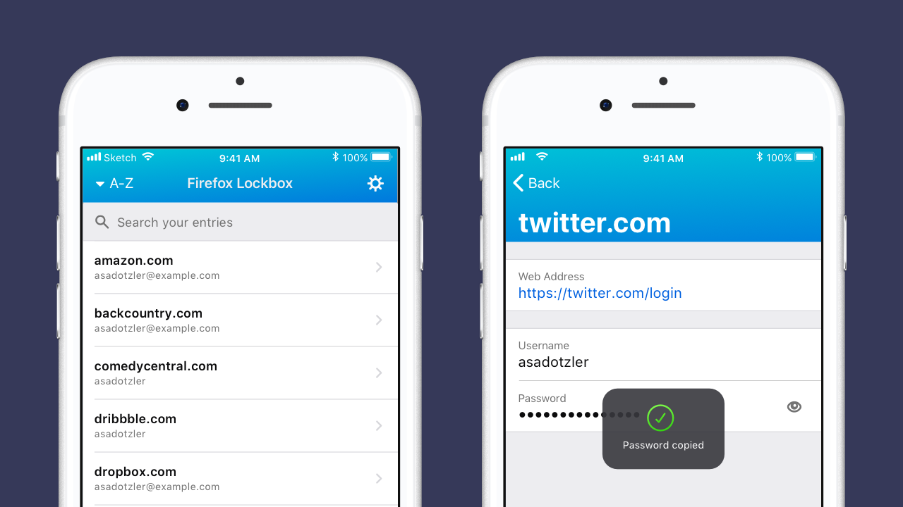
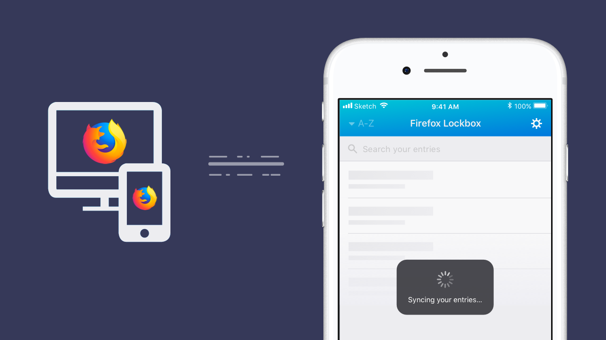
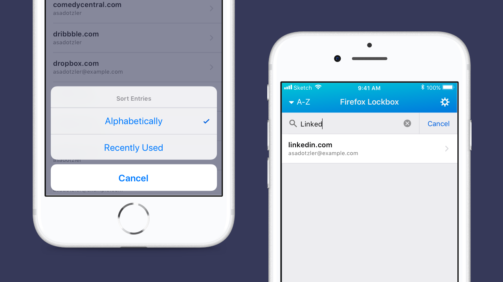

This website is to gather documentation and details for Mozilla's experimental
product: [Firefox Lockbox][website]. Firefox Lockbox will be the framework for
us to test and quickly iterate on hypotheses (on desktop and mobile). All
[planning and work](/process.md) is reflected on our [Waffle.io kanban board]([waffle]).

# Products

**Firefox Lockbox lets you easily access your passwords everywhere. Logins are stored and synced securely, using 256-bit encryption, keeping your information safe. Easily copy username and password details to get into apps and websites. Never again find yourself locked out of your account while on your phone!**

## iOS mobile app

Easily copy username and password details to get into apps and websites. Never again find yourself locked out of your account while on your phone!

**Firefox Lockbox requires a Firefox Account in order to access your previously saved logins. If you do not have an account set up, get started [here](https://lockbox.firefox.com/faq.html#how-do-i-enable-sync-on-firefox).**

Access username and password information for all the accounts you save to Firefox.

Manage accounts in Firefox and sync changes automatically to Firefox Lockbox.

Sort and filter on your accounts to quickly locate the one you need.

## Android mobile app

Coming soon...

[website]: https://lockbox.firefox.com/
[waffle]: https://waffle.io/mozilla-lockbox/lockbox-extension
